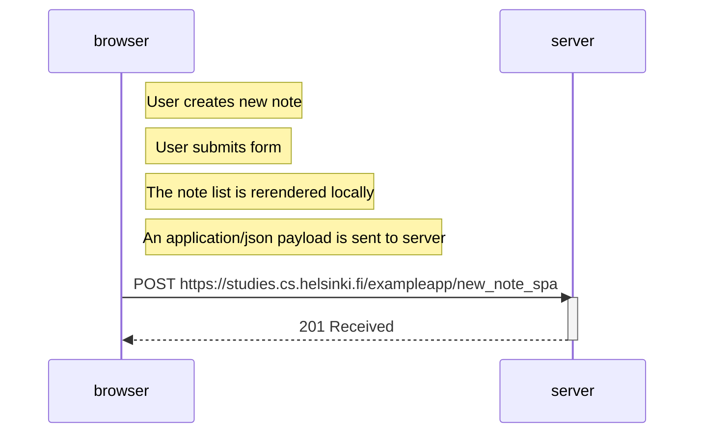

```mermaid
sequenceDiagram
    participant browser
    participant server

    Note right of browser: User creates new note
    Note right of browser: User submits form
    Note right of browser: The note list is rerendered locally
    Note right of browser: An application/json payload is sent to server


    browser->>server: POST https://studies.cs.helsinki.fi/exampleapp/new_note_spa
    activate server 
    server-->>browser: 201 Received
    deactivate server
```